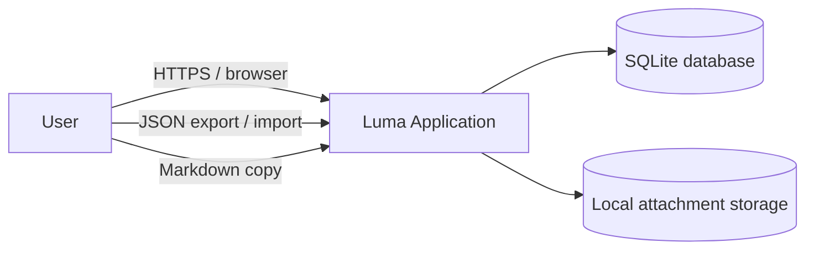
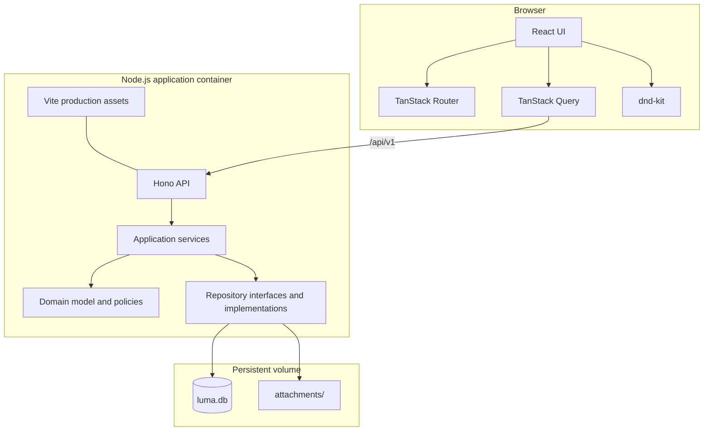
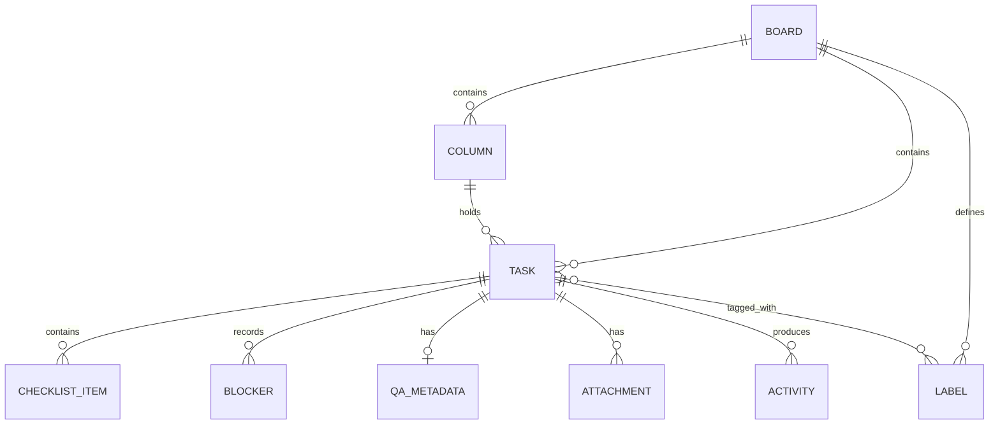
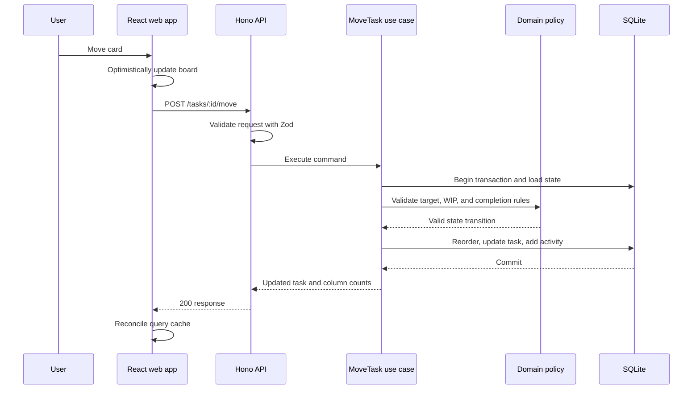

# Luma Software Architecture

**Status:** Proposed for MVP  
**Product:** Open-source, self-hosted personal Kanban board  
**Architecture style:** Modular monolith with a React single-page application and a Hono API  
**Last updated:** 22 September 2026

---

## 1. Architecture goals

Luma must be:

- Lightweight enough to run on a small machine or personal server.
- Simple for open-source contributors to understand and extend.
- Reliable when cards are moved, reordered, blocked, completed, imported, or exported.
- Accessible through pointer, touch, and keyboard interactions.
- Private by default, with no mandatory cloud dependency or telemetry.
- Structured so business rules do not depend on React, Hono, or SQLite.
- Capable of evolving from a single-user application without prematurely implementing team collaboration.

## 2. Approved technology stack

| Concern                  | Technology             |
| ------------------------ | ---------------------- |
| Language                 | TypeScript             |
| Frontend                 | React + Vite           |
| Routing                  | TanStack Router        |
| Remote state             | TanStack Query         |
| Forms                    | React Hook Form        |
| API                      | Hono on Node.js        |
| API typing               | Hono RPC               |
| Validation               | Zod                    |
| Database                 | SQLite                 |
| ORM and migrations       | Drizzle ORM            |
| Drag and drop            | dnd-kit                |
| Styling                  | Tailwind CSS           |
| UI primitives            | shadcn/ui and Radix UI |
| Unit/integration testing | Vitest                 |
| Component testing        | React Testing Library  |
| End-to-end testing       | Playwright             |
| Package management       | pnpm workspaces        |
| Deployment               | Docker Compose         |
| CI                       | GitHub Actions         |

## 3. System context



Luma has no required external service in the MVP. The user accesses a React SPA. The SPA calls the Hono API on the same origin. The API applies domain rules and persists data to SQLite and an optional local attachment directory.

## 4. Container architecture

Luma is a modular monolith, not a microservice system.



In production, one Node.js container should serve both the compiled SPA and `/api/v1`. This avoids CORS configuration and keeps self-hosting simple.

## 5. Architectural layers

### 5.1 Presentation layer

Responsibilities:

- Render boards, columns, cards, dialogs, filters, summaries, and settings.
- Handle keyboard, pointer, and touch interactions.
- Maintain temporary UI state such as an open dialog or current drag operation.
- Display server errors and roll back failed optimistic updates.

The presentation layer must not implement WIP limits, focus-task limits, blocker rules, or ordering invariants.

### 5.2 API layer

Responsibilities:

- Define Hono routes.
- Parse path, query, and request-body input.
- Validate untrusted input with Zod.
- Invoke one application use case per endpoint.
- Map domain errors to stable HTTP responses.
- Add request identifiers and structured logs.

Route handlers must not contain SQL or core business rules.

### 5.3 Application layer

Responsibilities:

- Coordinate a complete use case.
- Load and save entities through repository interfaces.
- Start and commit database transactions.
- Call domain policies.
- Record activity entries.
- Return DTOs suitable for the API.

Representative use cases:

- `CreateBoard`
- `CreateTask`
- `MoveTask`
- `ReorderTask`
- `SetTodayFocus`
- `BlockTask`
- `ResolveBlocker`
- `GenerateDailySummary`
- `ImportBoard`
- `ExportBoard`

### 5.4 Domain layer

Responsibilities:

- Define entities, value objects, policies, and domain errors.
- Enforce rules without depending on React, HTTP, Drizzle, or SQLite.

Core policies include:

- A board title and task title cannot be empty.
- Every MVP board has exactly five columns, one for each immutable status type; users may rename and reorder them but may not add or delete them.
- A board can have no more than three Today Focus tasks; completing or archiving a task clears its focus flag.
- Any operation that increases a limited column’s task count—move, create, restore, or unblock—requires explicit confirmation when the resulting count exceeds the limit.
- Completing a task sets `completedAt`; moving it out of Done clears it.
- Entering Blocked requires a blocker category and reason and creates an active blocker record.
- A task can have at most one unresolved blocker.
- Resolving a blocker records resolution time and notes.
- Generic movement rejects transitions into or out of Blocked; dedicated block/unblock use cases own those atomic transitions.
- Label names are unique per board after trim and case normalization; deleting a label only removes associations.
- Card position changes must preserve a deterministic order.

### 5.5 Infrastructure layer

Responsibilities:

- Implement repositories with Drizzle.
- Manage SQLite transactions and migrations.
- Store and retrieve attachments.
- Provide clock, ID generation, and logging adapters.
- Build import/export files.

## 6. Repository structure

```text
luma/
├── apps/
│   ├── web/
│   │   ├── src/
│   │   │   ├── routes/
│   │   │   ├── features/
│   │   │   │   ├── boards/
│   │   │   │   ├── tasks/
│   │   │   │   ├── blockers/
│   │   │   │   ├── focus/
│   │   │   │   └── summaries/
│   │   │   ├── components/
│   │   │   ├── hooks/
│   │   │   └── lib/
│   │   └── vite.config.ts
│   └── api/
│       └── src/
│           ├── routes/
│           ├── middleware/
│           ├── presenters/
│           ├── app.ts
│           └── server.ts
├── packages/
│   ├── application/
│   │   └── src/use-cases/
│   ├── domain/
│   │   └── src/
│   │       ├── entities/
│   │       ├── policies/
│   │       ├── errors/
│   │       └── ports/
│   ├── database/
│   │   ├── src/
│   │   │   ├── schema/
│   │   │   ├── repositories/
│   │   │   └── client.ts
│   │   └── migrations/
│   ├── contracts/
│   │   └── src/
│   │       ├── boards.ts
│   │       ├── tasks.ts
│   │       └── errors.ts
│   └── ui/
├── tests/
│   ├── integration/
│   └── e2e/
├── data/                       # ignored local development data
├── Dockerfile
├── docker-compose.yml
├── pnpm-workspace.yaml
└── README.md
```

Avoid extracting packages until a real boundary exists. `packages/ui` is optional for MVP; app-local components are preferable until reuse is demonstrated.

## 7. Frontend architecture

### 7.1 State ownership

| State type                        | Owner                         |
| --------------------------------- | ----------------------------- |
| Boards, tasks, columns, labels    | TanStack Query                |
| Route and filter parameters       | TanStack Router search params |
| Form values and validation        | React Hook Form + Zod         |
| Open dialogs, hover, drag preview | Local React state             |
| Optimistic card movement          | TanStack Query mutation cache |

Do not add Redux, Zustand, or another global store until a concrete requirement cannot be handled by these owners.

### 7.2 Feature organization

Each feature should contain its UI, hooks, API calls, and tests while importing contracts from `packages/contracts`.

```text
features/tasks/
├── api/
├── components/
├── hooks/
├── schemas/
└── tests/
```

### 7.3 Optimistic movement

When a task is moved:

1. Cancel in-flight board queries.
2. Snapshot the current board state.
3. Optimistically update the card's column and position.
4. Send one move command to the API.
5. Replace the optimistic state with the server response.
6. On failure, restore the snapshot and show an actionable error.
7. Invalidate the board query to guarantee convergence.

The client may preview WIP overflow, but the server remains authoritative.

### 7.4 Accessibility

- Every drag action must have keyboard controls and non-drag alternatives.
- Announce card movement through an ARIA live region.
- Preserve visible focus after movement.
- Do not communicate priority, status, or blocking through color alone.
- Dialogs must trap focus and return focus to their trigger.
- Target WCAG 2.2 AA for primary workflows.

## 8. API architecture

### 8.1 Route conventions

Base path: `/api/v1`

```http
GET    /health
GET    /api/v1/boards
POST   /api/v1/boards
GET    /api/v1/boards/:boardId
PATCH  /api/v1/boards/:boardId
POST   /api/v1/boards/:boardId/archive
POST   /api/v1/boards/:boardId/restore
DELETE /api/v1/boards/:boardId              # archived boards only

PATCH  /api/v1/columns/:columnId
POST   /api/v1/boards/:boardId/columns/reorder

GET    /api/v1/boards/:boardId/tasks        # search/filter/pagination query
POST   /api/v1/boards/:boardId/tasks
GET    /api/v1/tasks/:taskId
PATCH  /api/v1/tasks/:taskId
POST   /api/v1/tasks/:taskId/move
POST   /api/v1/tasks/:taskId/focus
DELETE /api/v1/tasks/:taskId/focus
POST   /api/v1/tasks/:taskId/block
POST   /api/v1/tasks/:taskId/unblock
POST   /api/v1/tasks/:taskId/archive
POST   /api/v1/tasks/:taskId/restore
GET    /api/v1/tasks/:taskId/activity

POST   /api/v1/tasks/:taskId/checklist
PATCH  /api/v1/checklist/:itemId
DELETE /api/v1/checklist/:itemId
GET    /api/v1/boards/:boardId/labels
POST   /api/v1/boards/:boardId/labels
PATCH  /api/v1/labels/:labelId
DELETE /api/v1/labels/:labelId
POST   /api/v1/tasks/:taskId/labels/:labelId
DELETE /api/v1/tasks/:taskId/labels/:labelId

GET    /api/v1/boards/:boardId/summary      # requires IANA time-zone query
GET    /api/v1/boards/:boardId/export
POST   /api/v1/import
```

`POST /tasks/:taskId/move` must reject transitions into or out of the Blocked status. The client uses `block` and `unblock` for those transitions, with blocker data, target column, expected record version, and WIP-overflow confirmation in the relevant command. Create and restore commands also accept WIP confirmation when their target column is limited.

### 8.2 Error contract

```json
{
  "error": {
    "code": "WIP_LIMIT_EXCEEDED",
    "message": "The In Progress column has reached its WIP limit.",
    "details": {
      "limit": 3,
      "current": 3
    },
    "requestId": "req_01K..."
  }
}
```

Use stable machine-readable codes. Expected domain failures are not logged as server crashes.

Suggested status mapping:

- `400` invalid input
- `404` entity not found
- `409` state conflict, WIP confirmation required, or stale update
- `413` attachment/import too large
- `422` valid JSON that violates a domain rule
- `500` unexpected server error

### 8.3 Concurrency control

Even a single-user app may have multiple tabs. Mutable records should include a numeric `version` field. Update commands send the expected version. An update with an old version returns `409 CONFLICT`, preventing silent overwrites.

Hono RPC provides TypeScript inference inside the monorepo. Zod remains mandatory at runtime because TypeScript types do not validate network input.

## 9. Data architecture

### 9.1 Main relationships



### 9.2 Schema conventions

- Use text IDs generated with UUIDv7 or ULID.
- Store timestamps as UTC ISO-8601 strings or integer epoch milliseconds consistently.
- Store nullable completion and archival timestamps instead of separate booleans.
- Enable SQLite foreign keys.
- Use `CHECK` constraints for enums and non-negative WIP limits where practical.
- Use indexes for board/column relationships, ordering, due dates, completion, and active blockers.

### 9.3 Card ordering

Use integer positions with gaps, for example `1024`, `2048`, and `3072`.

- Insert between two cards using the midpoint when a gap exists.
- When no integer gap remains, rebalance only the affected column in one transaction.
- Never use array index as durable identity.
- Add a unique constraint on `(column_id, position)`.

This is simpler and safer for SQLite than relying on floating-point positions.

### 9.4 SQLite configuration

At startup:

- Enable foreign keys.
- Enable WAL journal mode.
- Configure a bounded busy timeout.
- Apply migrations before accepting traffic.
- Refuse to start if a migration fails.

All moves, reorders, imports, and multi-record state transitions must use database transactions.

### 9.5 Attachments (post-MVP capability)

Binary uploads are deferred from the MVP; evidence URLs remain supported. If local attachments are added later, store attachment metadata in SQLite and file content under the persistent data directory. Requirements:

- Generate server-side storage names; do not trust uploaded filenames.
- Restrict permitted MIME types and maximum size.
- Prevent path traversal.
- Delete files only after the related database transaction succeeds, or use a cleanup job for orphaned files.
- Exclude executable content by default.

Attachments can be postponed without changing the rest of the architecture.

## 10. Important request flows

### 10.1 Move a task



If validation fails, the API returns a domain error and the frontend restores its snapshot.

### 10.2 Import a board

1. Upload JSON with a strict size limit.
2. Parse and validate the complete versioned export schema.
3. Reject unknown or unsupported schema versions.
4. Build an import plan without modifying persisted data.
5. Insert the complete board inside one transaction.
6. Roll back everything if any record fails.
7. Return the new board ID and import summary.

Never partially import a board.

## 11. Security and privacy

The MVP has no login and is intended for trusted private networks or localhost. Documentation must clearly state that exposing it publicly without an authentication proxy is unsafe.

Required controls:

- Bind to a configurable host; default conservatively for local development.
- Validate every request on the server.
- Escape rendered user content; sanitize any supported Markdown or HTML.
- Set security headers, including CSP, `X-Content-Type-Options`, and frame restrictions.
- Use same-origin deployment to avoid broad CORS rules.
- Limit JSON, import, and attachment request sizes.
- Never include stack traces or local filesystem paths in production responses.
- Avoid logging descriptions, test data, evidence, or other user content.
- Ship telemetry disabled; no data may leave the instance without explicit opt-in.
- Document reverse-proxy authentication as the interim option before native authentication exists.

## 12. Reliability and recovery

- Expose `/health` for process and database readiness.
- Use graceful shutdown and stop accepting traffic before closing the database.
- Persist `/app/data` through a Docker volume.
- Provide documented backup and restore commands.
- Recommend backing up with SQLite's online backup mechanism rather than copying an active database blindly.
- Exported board JSON must include a schema version.
- A failed optimistic update must never appear successful indefinitely.
- Database mutation errors must result in transaction rollback.

## 13. Observability

Use structured JSON logs in production with:

- timestamp
- level
- request ID
- HTTP method and route template
- response status
- duration
- error code, if present

Do not log request bodies by default. Metrics and remote error reporting are post-MVP and must be opt-in.

## 14. Testing architecture

### Unit tests

Test domain policies without HTTP or a live database:

- WIP-limit decisions
- maximum Today Focus tasks
- completion transitions
- blocking and resolution
- blocked-duration calculation
- position allocation and rebalance
- daily-summary generation
- import-schema validation

### Integration tests

Run against a temporary SQLite database:

- repositories and constraints
- transaction rollback
- task movement and reorder
- version conflicts
- full import/export round trip
- API validation and error mapping

### Component tests

Test:

- cards and column state
- forms and validation messages
- filters
- keyboard movement
- optimistic rollback presentation

### End-to-end tests

Use Playwright for the critical path:

1. Create a board and task.
2. Move and reorder a task.
3. Trigger and confirm WIP overflow.
4. Block and unblock a task.
5. Select Today Focus tasks.
6. Generate and copy a daily summary.
7. Export and re-import a board.
8. Refresh and verify persistence.
9. Complete the core flow using only a keyboard.

## 15. Deployment architecture

```yaml
services:
  luma:
    image: ghcr.io/example/luma:latest
    ports:
      - '3000:3000'
    volumes:
      - luma-data:/app/data
    environment:
      PORT: 3000
      DATABASE_URL: file:/app/data/luma.db
      DATA_DIR: /app/data
    restart: unless-stopped

volumes:
  luma-data:
```

Production image requirements:

- Multi-stage Docker build.
- Non-root runtime user.
- Pinned Node.js LTS base image.
- Health check.
- Read-only application files with only `/app/data` writable where feasible.
- Graceful `SIGTERM` handling.
- Migration execution before the HTTP server becomes ready.

## 16. CI pipeline

Every pull request should run:

1. Dependency installation with a frozen lockfile.
2. Formatting check.
3. Linting.
4. Type checking.
5. Unit tests.
6. Integration tests.
7. Production build.
8. Playwright smoke tests.
9. Dependency and container vulnerability scanning.

Releases should build a versioned container image and attach checksums and release notes.

## 17. Performance targets

- Initial application load under 2 seconds on typical local hardware for a board containing 1,000 tasks.
- Immediate local feedback for board interactions, targeting under 100 ms.
- Typical API mutations under 500 ms.
- Search under 300 ms for 10,000 tasks.
- Board endpoints should return only the data needed by the active view; archive/history pagination is required when records grow.

Virtualized columns are not required initially but may be introduced for unusually large boards after measurement.

## 18. Evolution path

### MVP

- Single user and workspace.
- Same-origin SPA and API.
- SQLite and local file storage.
- No required cloud services.

### Possible later evolution

- Add native authentication and sessions.
- Add a user/workspace ownership boundary before team features.
- Publish OpenAPI when supporting third-party clients.
- Add PostgreSQL only if collaboration or write concurrency justifies it.
- Add WebSocket or server-sent events only for validated real-time collaboration needs.
- Add a PWA and IndexedDB only if offline-first usage becomes a validated requirement.

Do not introduce Redis, queues, microservices, or Kubernetes without measured operational need.

## 19. Architecture decision records

### ADR-001: React and Vite for the application UI

**Decision:** Use React with Vite.  
**Reason:** The product is interaction-heavy and benefits from React's mature ecosystem. Vite provides a small, predictable SPA toolchain.  
**Rejected:** Astro for the main application because most of the board is interactive. Astro remains suitable for a separate documentation site.

### ADR-002: Hono on Node.js for the API

**Decision:** Run Hono on Node.js for the MVP.  
**Reason:** Hono is lightweight, TypeScript-friendly, and sufficient for the API while Node.js provides a mature runtime.  
**Constraint:** Do not optimize for edge or multi-runtime deployment in the MVP.

### ADR-003: Modular monolith

**Decision:** Keep the UI, API, application, domain, and persistence modules in one repository and one deployable application.  
**Reason:** It minimizes operational complexity while maintaining internal boundaries.

### ADR-004: SQLite with Drizzle

**Decision:** Use SQLite and Drizzle migrations.  
**Reason:** SQLite is appropriate for a single-user self-hosted product and requires almost no administration.  
**Revisit when:** Multi-user write concurrency or horizontal scaling becomes a validated requirement.

### ADR-005: Hono RPC plus runtime schemas

**Decision:** Use Hono RPC for internal client inference and Zod for runtime validation.  
**Reason:** Static inference improves contributor experience, while Zod protects the trust boundary.  
**Revisit when:** External or non-TypeScript clients require a published OpenAPI contract.

### ADR-006: No authentication in the MVP

**Decision:** Do not include application-level authentication initially.  
**Reason:** The first release is a personal self-hosted tool. Authentication would increase scope substantially.  
**Consequence:** The documentation must warn users not to expose Luma directly to the public internet and describe reverse-proxy protection.

## 20. Definition of architecture complete

The foundation is ready for product implementation when:

1. The monorepo builds with one documented command.
2. The React client calls a typed Hono endpoint.
3. Every API input is validated at runtime.
4. Domain policies run without React, Hono, Drizzle, or SQLite imports.
5. A migration creates the SQLite schema successfully.
6. A task move is transactional and supports optimistic rollback.
7. Data survives a container restart.
8. Health checks and graceful shutdown work.
9. Unit, integration, and end-to-end smoke tests run in CI.
10. A contributor can start development and production environments from the README.
